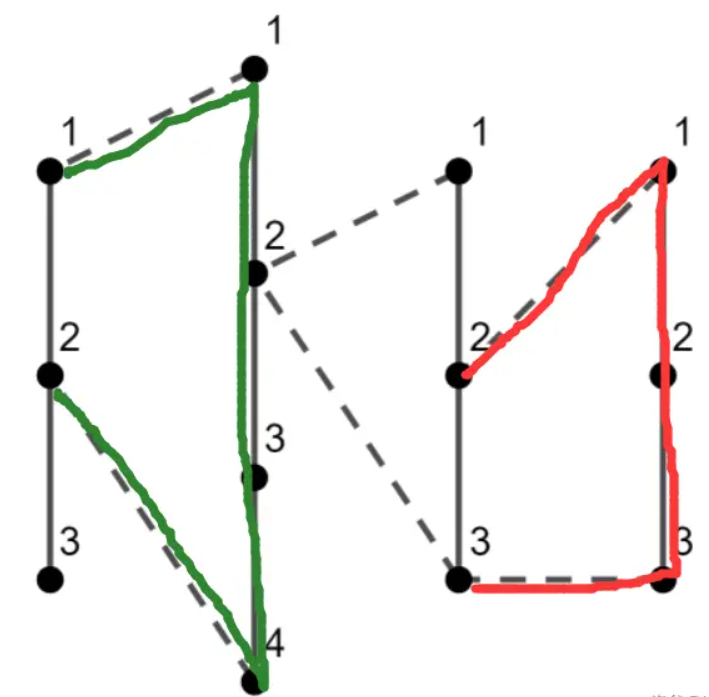

原题：CF1476C
难度：普及+/提高，1600

算法：动态规划，图论，贪心

## 分析

考虑扫一遍这些链。

我们定义“半圈”表示差一条链子的一部分就可以变成一个环的部分。例如下图中的红色链与绿色链都是半圈。

 
 记目前到的这个半圈的长度为 now。

我们每到一个链子，都有以下两种操作：

放弃前面的部分，从这个链子开始继续考虑；

将这个链子接上前面的链子作为一个半圈，继续维护半圈长度。

同时，在遍历的时候随时对当前的半圈长度加上当前遍历到的链与左侧连接点两点之间距离取 
max
⁡
max。详见代码：
## 实现

```cpp
#include <bits/stdc++.h>
#define int long long
#define rep(i,a,b) for(int i=(a);i<=(b);++i)
#define per(i,a,b) for(int i=(a);i>=(b);--i)
using namespace std;
int _,n,c[100005],a[100005],b[100005];
int now=0,ans=0;
signed main() {
    for(scanf("%lld",&_);_;--_) {
        now=0;ans=0;
        scanf("%lld",&n);
        rep(i,1,n) {
            scanf("%lld",&c[i]);
        }
        rep(i,1,n) scanf("%lld",&a[i]);
        rep(i,1,n) scanf("%lld",&b[i]);
        per(i,n,2) {
            if(!now) now=c[i]-1;
            if(a[i]==b[i]) ans=max(ans,now+2),now=0;
            else {
                now+=2;
                ans=max(ans,now+abs(a[i]-b[i]));
                now+=c[i-1]-1-abs(a[i]-b[i]);
                if(c[i-1]-1>now) now=c[i-1]-1;
            }
        }
        printf("%lld\n",ans);
    }
    return 0;
}
```