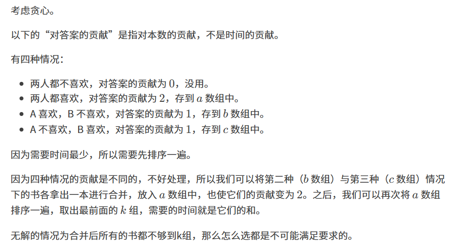

原题：CF1732D1

难度：1600

算法：贪心 数据结构 排序



```cpp
#include <bits/stdc++.h>
#define int long long
using namespace std;
const int N=2e5+10; 
int n,k,cnt1,cnt2,cnt3,daan;
int a[N],b[N],c[N];
signed main()
{
	cin>>n>>k;
	for(int i=1,time,A,B;i<=n;i++)
	{
		cin>>time>>A>>B;
		if(!A&&!B) continue;//��һ�����
		else if(A&&B) a[++cnt1]=time;//�ڶ��� 
		else if(A&&!B) b[++cnt2]=time;//������ 
		else if(!A&&B) c[++cnt3]=time;//������ 
	}
	
	sort(b+1,b+1+cnt2),sort(c+1,c+1+cnt3);//����
	 
	for(int i=1;i<=min(cnt2,cnt3);i++)
		a[++cnt1]=b[i]+c[i];//�ϲ���ʹ������ͬ 
		
	if(cnt1<k) return cout<<-1,0;//�޽� 
	
	sort(a+1,a+1+cnt1);
	for(int i=1;i<=k;i++) daan+=a[i];
	cout<<daan;
	return 0;
}

```