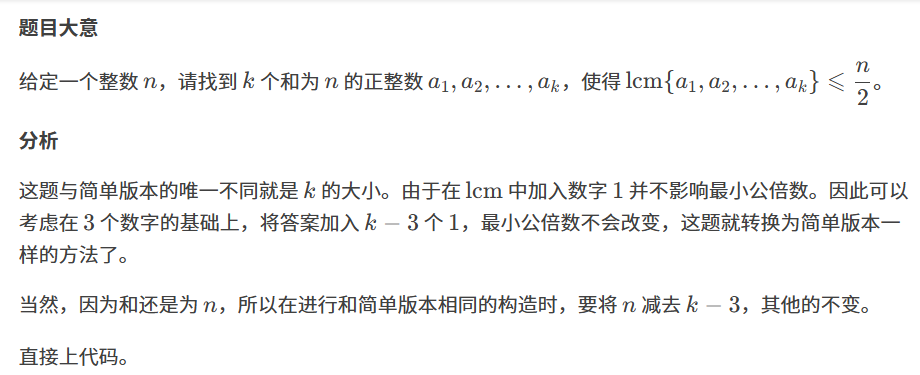

原题：CF1497C2

难度：1600

算法：数学 构造



```cpp
#include<bits/stdc++.h>
using namespace std;
int t,n,k;
int main()
{
   cin>>t;
   while(t--)
   {
    cin>>n>>k;
    for(int i=1;i<=k-3;i++)cout<<1<<' ';//本题新增，输出k-3个1
    n-=k-3;//将n减去k-3
    if(n%2)cout<<1<<' '<<n/2<<' '<<n/2<<'\n';
    else if(n%4)cout<<2<<' '<<n/2-1<<' '<<n/2-1<<'\n';
    else cout<<n/2<<' '<<n/4<<' '<<n/4<<'\n';
   }
   return 0;
}

```