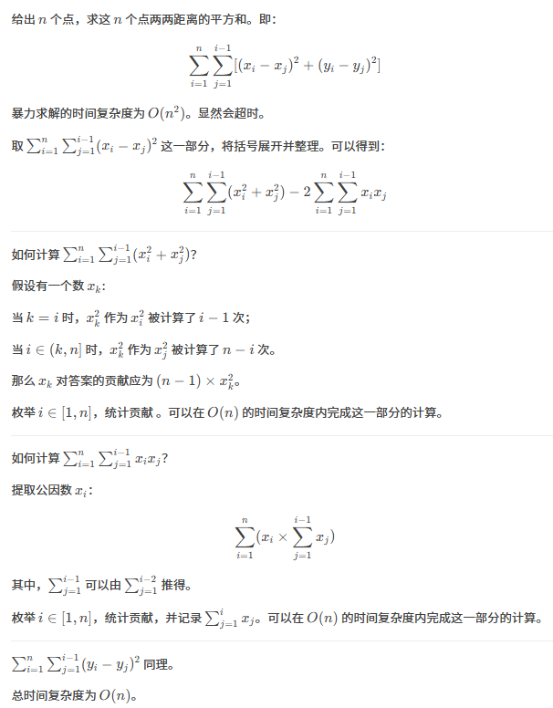

原题：CF76E

难度：1700

算法：数学

## 思路



## 实现
```cpp
#include<cstdio>
int main(){
	long long ans=0;
	long long sx=0,sy=0;
	//sx,sy用于记录累加和。
	int n;
	scanf("%d",&n);
	for(int i=0;i<n;++i){
		int x,y;
		scanf("%d%d",&x,&y);
		ans+=(n-1LL)*(x*x+y*y)-((x*sx+y*sy)<<1);
		sx+=x,sy+=y;
	}
	printf("%lld\n",ans);
	return 0;
}
```