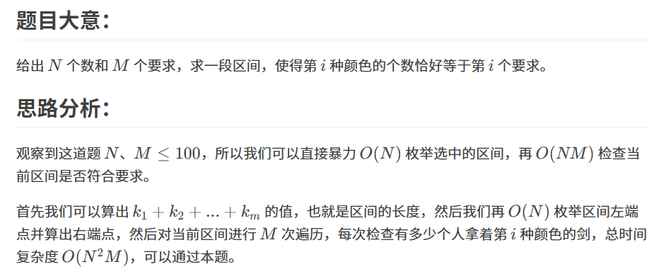

原题：CF958F1

难度：1500

算法：模拟

## 思路



## 实现
```cpp
#include <bits/stdc++.h>
using namespace std;
int n,m,d[105],k[105],sum,cnt;
int main(){
	bool flag;
	scanf("%d%d",&n,&m);
	for(int i=1;i<=n;i++)
		scanf("%d",&d[i]);
	for(int i=1;i<=m;i++){
		scanf("%d",&k[i]);
		sum+=k[i];
	}
	for(int l=1,r;l<=n;l++){//枚举选中的区间
		r=sum+l-1,flag=1;
		for(int i=1;i<=m;i++){//检查当前区间是否符合要求
			cnt=0;
			for(int j=l;j<=r;j++)
				if(d[j]==i)  cnt++;
			if(cnt!=k[i]){
				flag=0;
				break;
			}
		}
		if(flag){
			printf("YES");
			return 0;
		}
	}
	printf("NO");
	return 0;
}

```