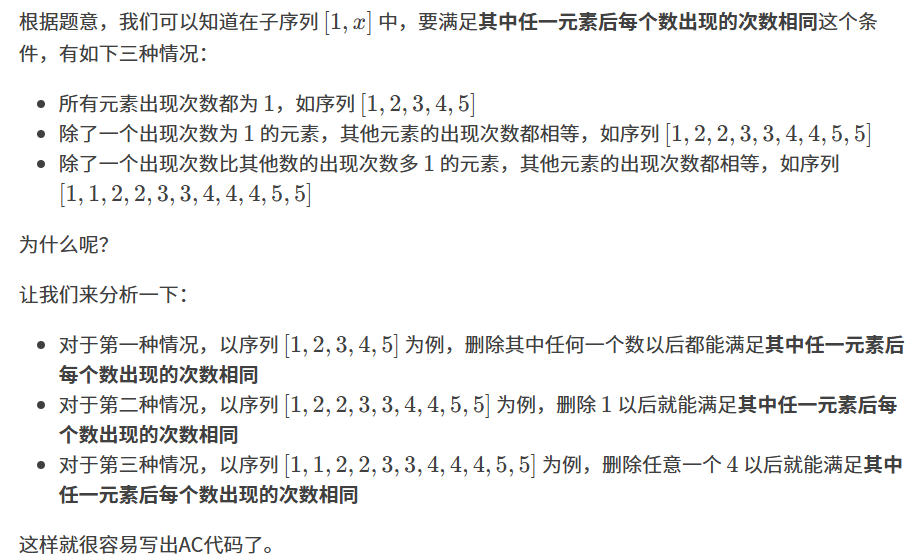

原题：CF1163B1

难度：1500

算法：数据结构

## 思路


## 实现
```cpp
#include<bits/stdc++.h>
#define caozuo ret[cnt[u[i]]]--;cnt[u[i]]++;ret[cnt[u[i]]]++;
using namespace std;
int cnt[100010],ret[100010],u[100010];
int main()
{
	int n;
	scanf("%d",&n);
	int ans=0;
	int mx=INT_MIN;
	for(int i=1;i<=n;i++)
	{
		scanf("%d",&u[i]);
		caozuo
		mx=max(mx,cnt[u[i]]);
		if(mx==1)
		{
			ans=i;
			continue;
		}
		if(ret[mx]*mx==i-1)
		{
			ans=i;
			continue;
		}
		if((ret[(mx-1)]+1)*(mx-1)==i-1)
		{
			ans=i;
			continue;
		}
	}
	printf("%d",ans);
}
```