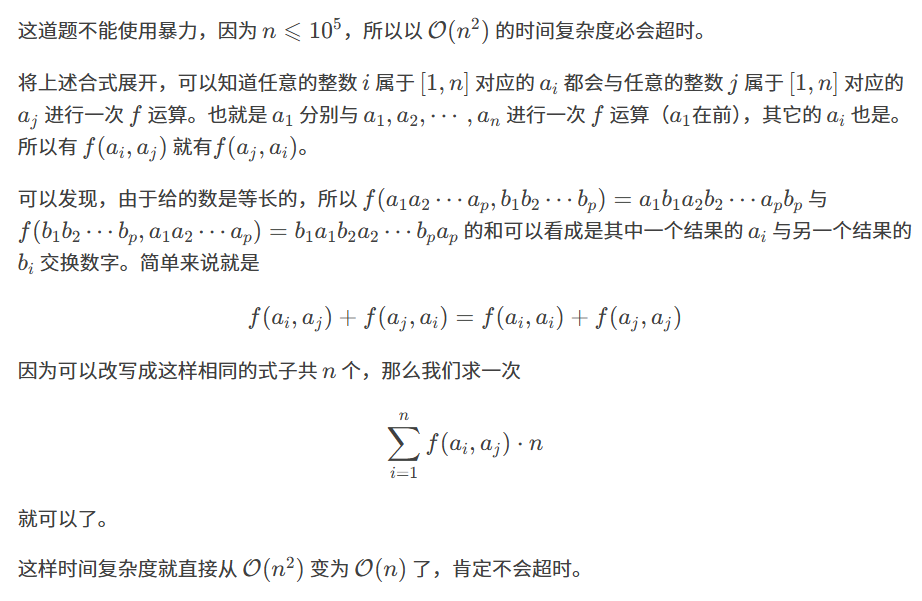

原题：CF1195D1

难度：1500

算法：组合数学 数论

## 思路



## 实现
```cpp
#include<bits/stdc++.h>
using namespace std;
#define int long long
#define MOD 998244353 //定义一个MOD

signed main()
{
	int n;
	int ans = 0;
	string s;
	cin >> n;
	for (int i = 0; i < n; i++)
	{
		cin >> s;
		int t = 0, len = s.length();
		for (int i = 0; i < len; i++)
		{
			for (int j = 0; j < 2; j++)
			{
				t = t * 10 + s[i] - '0'; //进行前面所说的操作
				t %= MOD; //这块一定要记得模一下
			}
		}
		ans += t;
		ans %= MOD; //这块也要模一下
	}
	ans *= n;
	ans %= MOD;
	cout << ans << endl;
	return 0; //完结撒花~
}

```