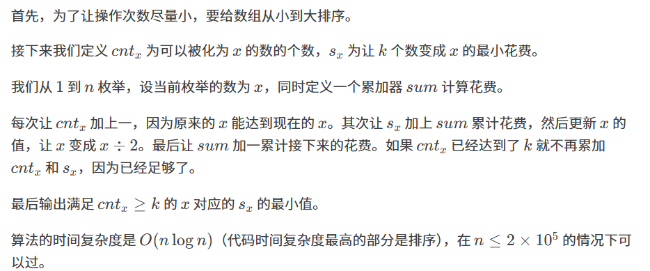

原题：CF1213D1

难度：1500

算法：暴力



```cpp
#include <bits/stdc++.h>
using namespace std;
int n, k, a[200001], s[200001], cnt[200001], ans = 2147483647;
int main(){
	scanf("%d%d", &n, &k);
	for (int i = 1; i <= n; i++) scanf("%d", &a[i]);
	sort(a + 1, a + n + 1);
	for (int i = 1; i <= n; i++){
		int x = a[i], sum = 0;
		while (x){
			if (cnt[x] < k) cnt[x]++, s[x] += sum;
			x /= 2; sum++;
		}
	}
	for (int i = 1; i <= 200000; i++)
		if (cnt[i] >= k) ans = min(ans, s[i]);
	printf("%d", ans);
	return 0;
}
```