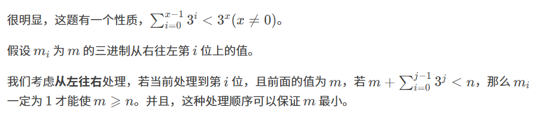
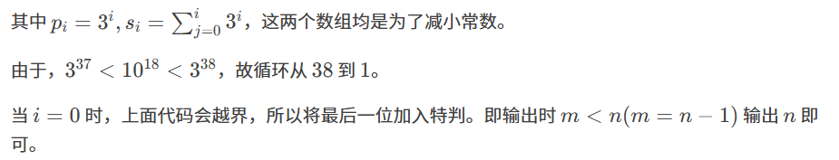

原题：CF1249C2

难度：1500

算法：二分 贪心 数学



```cpp
#include <stdio.h>
typedef long long ll;
int q; ll n, p[40] = {1}, s[40] = {1}; 
int main()
{
	scanf("%d", &q);
	for (int i(1); i < 39; ++i) s[i] = s[i - 1] + (p[i] = p[i - 1] * 3);
	while (q--)
   	{
		scanf("%lld", &n); ll m(0);
		for (int i(39); i; --i) if (m + s[i - 1] < n) m += p[i];
		printf("%lld\n", m < n ? n : m);
	}
    return 0;
}
```