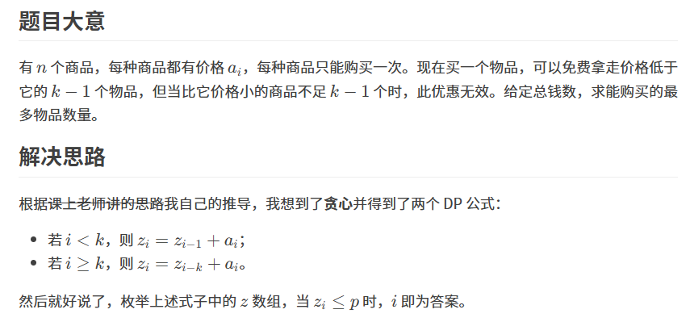

原题：CF1282b2

难度：1600

算法：dp 贪心 排序


```cpp
#include <iostream>
#include <algorithm>
#include <cstring>
using namespace std;

const int N = 3e6 + 80;
int t, n, p, k, a[N], z[N], ans;

int main()
{
	ios::sync_with_stdio(0);
    cin.tie(0), cout.tie(0);//减少输入时间
	cin >> t;
	while(t--)
	{
		ans = 0;
		cin >> n >> p >> k;
		for(int i = 1; i <= n; i++)
			cin >> a[i];
		sort(a + 1, a + n + 1);//从小到大排序
		for(int i = 1; i <= n; i++)
			z[i] = 0x3f3f3f3f;//代替memset,全部赋值
		for(int i = 1; i <= n; i++)
		{//分情况讨论 
			if(i >= k) z[i] = min(z[i], z[i - k] + a[i]);
			z[i] = min(z[i], z[i - 1] + a[i]);
		}
		for(int i = 1; i <= n; i++)
			if(z[i] <= p) ans = i;//枚举最终答案
		cout << ans << endl;
	}
}
```