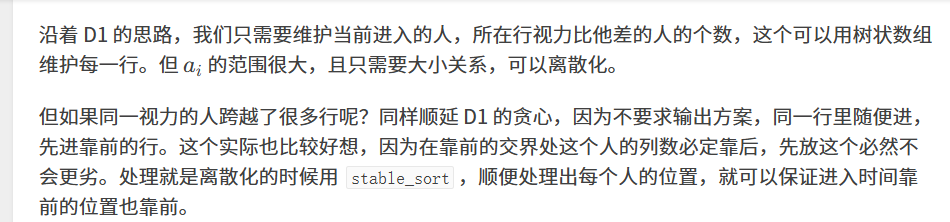

原题：CF1566D2

难度：1600

算法：数据结构 贪心 排序


```cpp
#include<iostream>
#include<cstdio>
#include<map>
#include<cstring>
#include<algorithm>
#define lowbit(x) x&-x 
using namespace std;
map<int,int> mp;
struct node {
	int elem,id;
	bool operator<(const node b) const {
		return this->elem<b.elem;
	}
}a[100005],b[100005];
int cnt,n,m;
int tree[305][90005];
//树状数组板子
//p是行数，每行用一个树状数组维护
inline void update(int p,int x) {
	for(;x<=cnt;x+=lowbit(x)) tree[p][x]++;
}
inline int query(int p,int x){
	int sum=0;
	for(;x;x-=lowbit(x)) sum+=tree[p][x];
	return sum;
}
int main() {
	int T;
	scanf("%d",&T);
	while(T--) {
		int ans=0;
		scanf("%d%d",&n,&m);
		for(int i=1;i<=n*m;i++)
			scanf("%d",&a[i].elem),b[i].elem=a[i].elem,b[i].id=i;
		stable_sort(b+1,b+n*m+1);
		mp.clear(),cnt=0;
		for(int i=1;i<=n*m;i++) {
			a[b[i].id].id=i;//a.id表示该人座位
			//离散化
			if(mp.find(b[i].elem)==mp.end()) mp[b[i].elem]=++cnt;
		}
		//十年CF一场空，memset见祖宗
		for(int i=1;i<=n;i++)
			for(int j=1;j<=cnt;j++)
				tree[i][j]=0;
		for(int i=1;i<=n*m;i++) {
			int l=(a[i].id-1)/m+1;//该人的行数
			//树状数组里存的是离散化后对应值的个数
			//所以query直接查询小于当前值的前缀和就是所需
			ans+=query(l,mp[a[i].elem]-1);
			update(l,mp[a[i].elem]);
		}
		cout<<ans<<'\n';
	} 
	return 0;
}
```