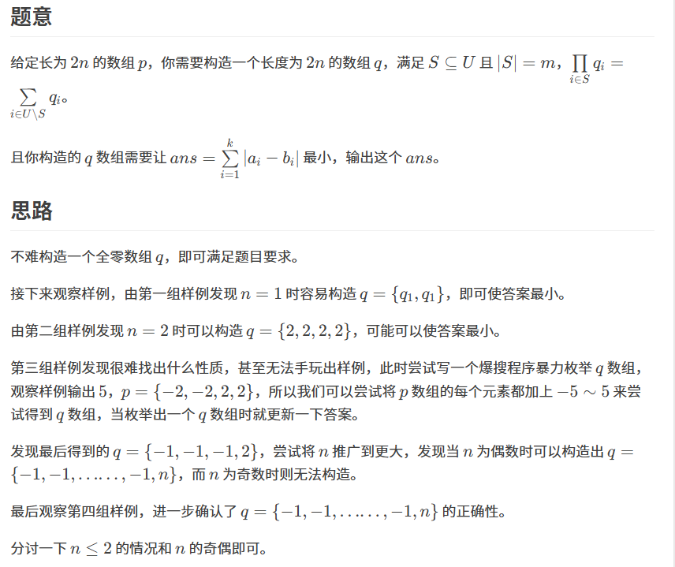

原题：CF1806c

难度：1600

算法：暴力 构造 数学 


```cpp
#include<cmath>
#include<iostream>
using namespace std;
int n;
long long a[400015];
int main(){
ios::sync_with_stdio(0),cin.tie(0),cout.tie(0);
int t;
cin>>t;
while(t--){
	cin>>n;
	int m=n<<1;
	long long maxn=-1e9;
	long long ans=0,res=0;
	for(int i=1;i<=m;i++){
		cin>>a[i];
		ans+=abs(a[i]);
		if(a[i]>maxn)maxn=a[i];
	}
	if(n==1){
		cout<<abs(a[1]-a[2])<<'\n';continue;
	}
	if(n&1){
		for(int i=1;i<=m;i++){
			res+=abs(a[i]);
		}
		cout<<res<<'\n';continue;
	}
	if(n==2){
		ans=min(abs(a[1])+abs(a[2])+abs(a[3])+abs(a[4]),abs(a[1]-2)+abs(a[2]-2)+abs(a[3]-2)+abs(a[4]-2));
	}
	for(int i=1;i<=m;i++){
		res+=abs(a[i]+1);
	}
	res-=abs(maxn+1);
	res+=abs(maxn-n);
	ans=min(ans,res);
	cout<<ans<<'\n';
}
return 0;
}
```