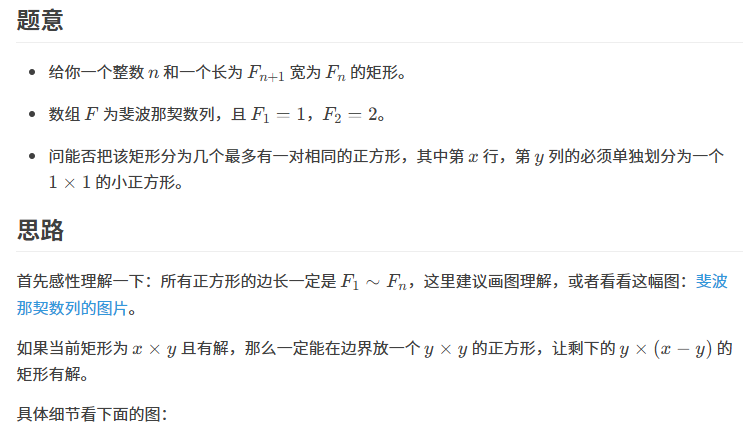
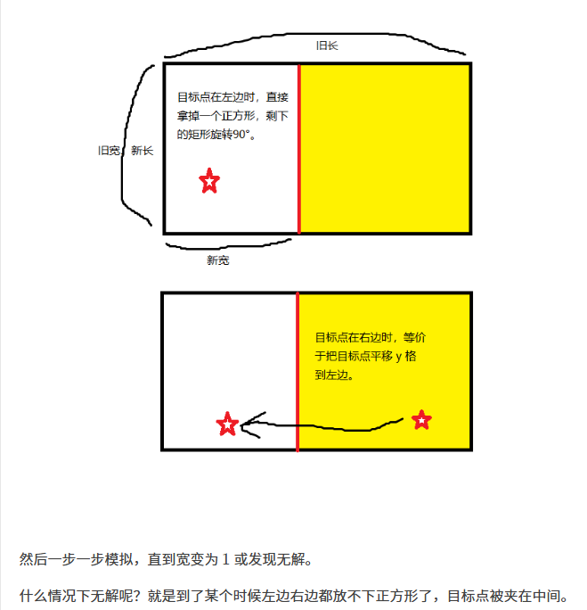

原题：CF1811d

难度：1600

算法：构造 数学 



```cpp
#include<cstdio>
using namespace std;
int t,n,f[46],x,y,h,l,tmp;
bool flg;
int main(){
	f[1]=1,f[2]=2,scanf("%d",&t);
	for(int i=3;i<46;++i)f[i]=f[i-1]+f[i-2];
	while(t--){
		scanf("%d%d%d",&n,&x,&y),flg=0,h=f[n+1],l=f[n];
		while(l>1&&!flg){
			tmp=y,y=x;
			if(tmp>l)x=tmp-l;
			else x=tmp;
			if(x<l)tmp=l,l=h-l,h=tmp;
			else flg=1;
		}printf("%s\n",flg?"NO":"YES");
	}
	return 0;
}
```