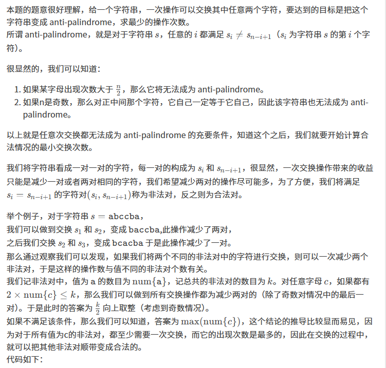

原题：CF1822e

难度：1600

算法：贪心 数学 字符串


```cpp
#include<bits/stdc++.h>
using namespace std;

int t, num[30];
char c[200010];

int main() {
	cin >> t;
	int n, cnt = 0;
	while(t--) {
		memset(num, 0, sizeof(num));
		cnt = 0;
		cin >> n;
		for(int i = 1; i <= n; i++) {
			cin >> c[i];
			num[c[i]-'a']++;  //此时num数组num[i]代表ascii码为(i+'a')的字符在该字符串中出现的次数
		}
		if(n % 2 != 0) {  //字符串中的字符个数为偶数则不可能成为anti
			cout << -1 << endl;
			continue;
		}
		int maxx = 0;
		for(int i = 0; i < 26; i++) {
			if(num[i] > maxx)
				maxx = num[i];
		}
		if(maxx > n/2) {  //某字符最多出现次数超过字符总数则也不可能成为anti
			cout << -1 << endl;
			continue;
		}
		memset(num, 0, sizeof(num));  //此时num为对应字符的非法对数
		for(int i = 1; i <= n/2; i++) {
			if(c[i] == c[n-i+1])
				cnt++, num[c[i]-'a']++;
		}
		maxx = 0;
		for(int i = 0; i < 26; i++) {
			if(num[i] > maxx)
				maxx = num[i];
		}
		if(maxx <= cnt-maxx)
			cnt = (cnt+1)/2;
		else
			cnt = maxx;
		cout << cnt << endl;
	}
    return 0;
}
```