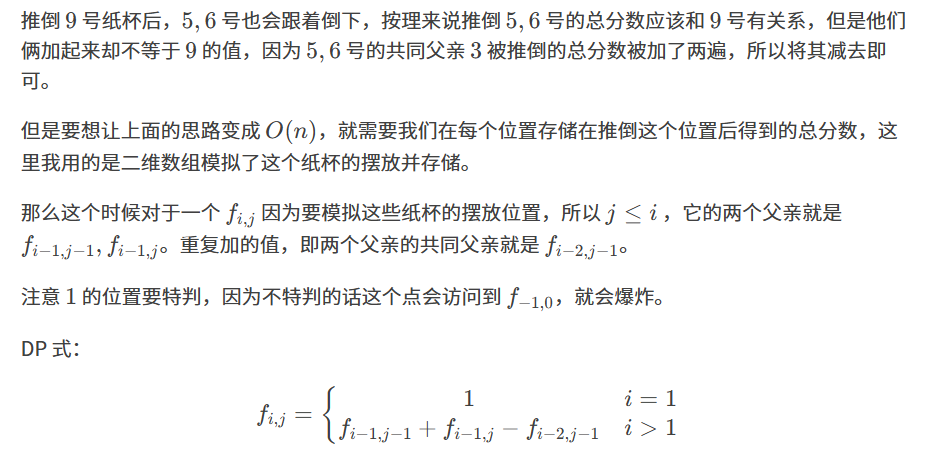

原题：CF1829g

难度：1600

算法：数据结构 dp 数学


```cpp
#include<iostream>
using namespace std;
long long t,n,cnt=1,a[2001][2001],b[4000001];
int main(){
    cin>>t;
    for(int i=1;i<=2000;i++){
        for(int j=1;j<=i;j++){
            a[i][j]=(i==1? 1:cnt*cnt+a[i-1][j-1]+a[i-1][j]-a[i-2][j-1]);
            b[cnt]=a[i][j];
            cnt++;
        }
    }
    while(t--){
        cin>>n;
        cout<<b[n]<<endl;
    }
}
```