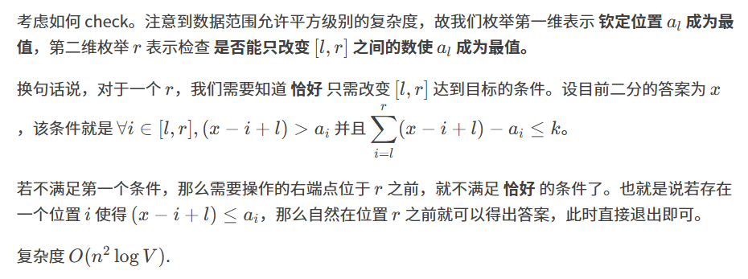

原题：CF1856c

难度：1600

算法: 二分答案 暴力 数据结构 dp

二分答案。

```cpp
#include <bits/stdc++.h>
// #define int long long
using namespace std;
const int MAXN = 2e5 + 5;
int T, n, a[MAXN], fa[MAXN], du[MAXN], cnt;
set<int> st;
map<pair<int, int>, bool> vis;
int find(int x) {
  return fa[x] == x ? x : fa[x] = find(fa[x]);
}
signed main() {
  ios::sync_with_stdio(0), cin.tie(0);
  for (cin >> T; T--;) {
    cin >> n, st.clear(), cnt = 0, vis.clear();
    for (int i = 1; i <= n; i++) {
      cin >> a[i], fa[i] = i, du[i] = 0;
    }
    for (int i = 1; i <= n; i++) {
      int u = i, v = a[i];
      fa[find(u)] = find(v);
      !vis[{u, v}] && (du[u]++, du[v]++);
      vis[{u, v}] = vis[{v, u}] = 1;
    }
    for (int i = 1; i <= n; i++) {
      st.insert(find(i));
      cnt += (du[i] == 1);
    }
    cout << min(st.size(), st.size() - cnt / 2 + 1) << ' ' << st.size() << '\n';
  }

  return 0;
}
```