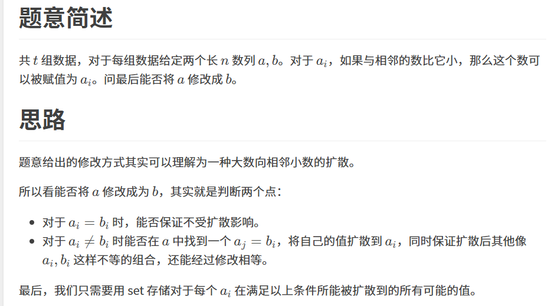

原题：CF1904D1

难度：1600

算法：暴力 贪心


```cpp
#include<iostream>
#include<set>
using namespace std;
int t,n,last,k,a[1005],b[1005];
int main(){
	scanf("%d",&t);
	while(t--){
		k=1;
		set<pair<int,int> > co;
		scanf("%d",&n);
		for(int i=1;i<=n;i++)scanf("%d",&a[i]);
		for(int i=1;i<=n;i++)scanf("%d",&b[i]);
		for(int i=1;i<=n;i++){
			for(int j=i-1;j>=1&&a[j]<a[i]&&a[i]<=b[j];j--)co.insert({j,a[i]});
			for(int j=i+1;j<=n&&a[j]<a[i]&&a[i]<=b[j];j++)co.insert({j,a[i]});
		}for(int i=1;i<=n;i++)
			if(a[i]!=b[i])
				if(!co.count({i,b[i]})){k=0;break;}
		printf(k?"YES\n":"NO\n");
	}return 0;
}
```