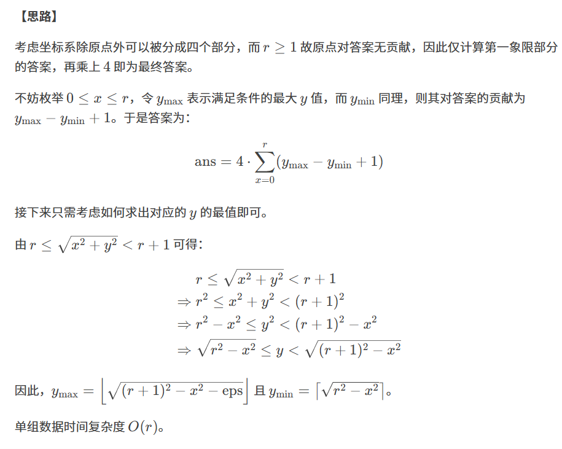

原题：CF1971f

难度：1600

算法：数学


```cpp
#include <bits/stdc++.h>
using namespace std;
#define int long long
#define endl '\n'
const int N = 1e5 + 5; const double EPS = 0.5;
int r, ans;
int f(int n) {
	return n * n;
}
void solve() {
	cin>>r;
	ans = 0;
	for(int i = 1; i <= r; i++) {
		int mx = floor(sqrt(f(r + 1) - f(i) - EPS));
		int mn = ceil(sqrt(f(r) - f(i)));
		// cout<<i<<" ["<<mn<<", "<<mx<<"]"<<endl;
		ans += mx - mn + 1;
	}
	cout<<ans * 4<<endl;
}
int t;
void file(string s) {
	freopen((s + ".in").c_str(), "r", stdin);
	freopen((s + ".out").c_str(), "w", stdout);
}
#define file(x) file(#x)
signed main() {
	// file(cf);
	cin>>t;
	while(t--) solve();
}
```