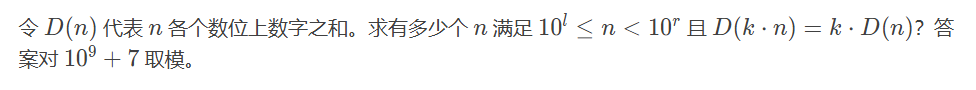

# D函数

## 题面




## 输入格式

第一行一个整数t:测试组数。1<=t<=10000。

每个测试样例三个整数l,r,k。0<=l<r<=10^9。1<=k<=10^9。
## 输出格式

对每组数据，输出答案，对10^9 + 7 取模 .

## 样例 #1

### 样例输入 #1

```
6
0 1 4
0 2 7
1 2 1
1 2 3
582 74663 3
0 3 1
```

### 样例输出 #1

```
2
3
90
12
974995667
999
```

## 提示

对于第一个测试用例， n $中满足条件的值只有$ 1 $和$ 2 。

对于第二个测试用例， n $中满足条件的值只有$ 1 $、$ 10 $和$ 11 。

对于第三个测试用例，在 10（包括 10）和$100（不包括$ 100）之间的所有n 值都满足条件。