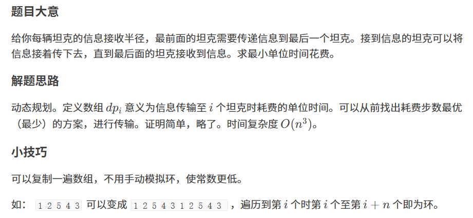

原题：CF207b1

难度：1600

算法：动态规划


```cpp
#include <iostream>
#include <cstring>
#define inf 0x3f3f3f3f
#define N 200002
using namespace std;
int n,a[N],dp[N],ans=0;
int main(){
	ios::sync_with_stdio(0);
	cin>>n;
	for(int i=1;i<=n;i++){
	    cin>>a[i];
	    a[n+i]=a[i];
	}
	for(int i=1;i<=n;i++){
		memset(dp,0,sizeof dp);
		for(int j=2;j<=n;j++){
			int minn=inf;
			for(int k=max(j-a[j+i-1],1);k<=j-1;k++)  minn=min(minn,dp[k]);
			dp[j]=minn+1;
		}
		ans+=dp[n];
	}
	cout<<ans;
	return 0;
}
```