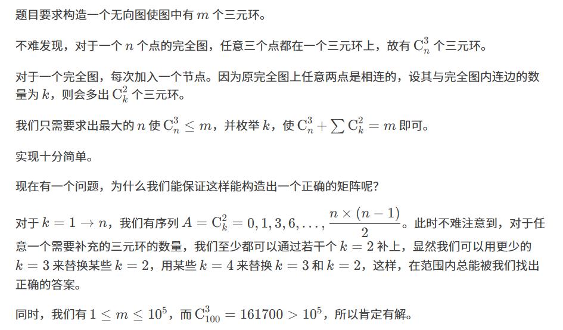

原题：CF232A

难度：1600

算法：二分查找 构造 图 贪心

## 思路



## 实现
```cpp
#include<bits/stdc++.h>
using namespace std;
#define ll long long
#define eps 1e-8
const int inf=0x3f3f3f3f;
const int Maxn=110;
int Lian[Maxn][Maxn];
int C(int x,int y)
{
	if(y==3)
	{
		return x*(x-1)*(x-2)/6;
	}
	if(y==2)
	{
		return x*(x-1)/2;
	}
}
int main()
{
	int m;
	scanf("%d",&m);
	int now=0;
	for(int i=1;i<=100;i++)
	{
		int Nodes=C(i,3);
		if(Nodes<=m)
		{
			now=i;
		}else{
			break;
		}
	}
	for(int i=1;i<=now;i++)
	{
		for(int j=1;j<=now;j++)
		{
			if(i==j) continue;
			Lian[i][j]=Lian[j][i]=1;
		}
	}
	m-=C(now,3);
	int Nd=now;
	for(int i=now;i>=2;i--)
	{
		while(C(i,2)<=m)
		{
			m-=C(i,2);
			Nd++;
			for(int j=1;j<=i;j++)
			{
				Lian[j][Nd]=Lian[Nd][j]=1;
			}
		}
	}
	printf("%d\n",Nd);
	for(int i=1;i<=Nd;i++)
	{
		for(int j=1;j<=Nd;j++)
		{
			printf("%d",Lian[i][j]);
		}
		putchar('\n');
	}

	return 0;
}

```