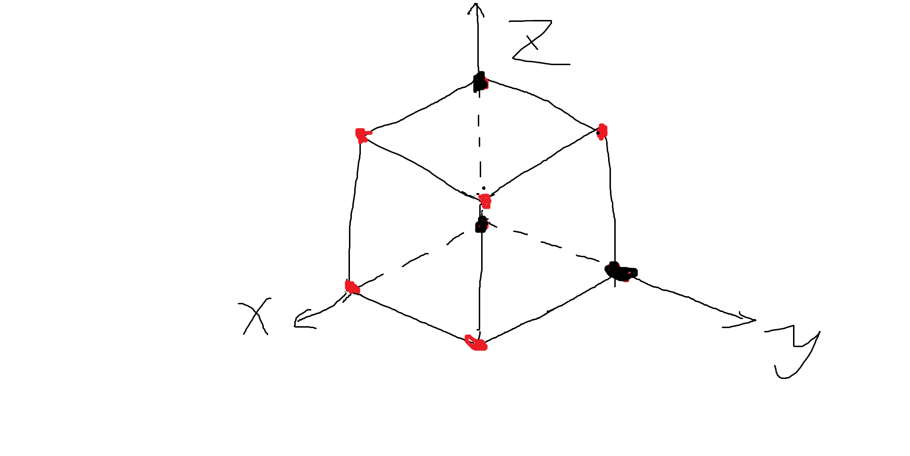

## 题解
原题：CF39d

难度：1100

算法：数学


### 解题思路：
首先，两只苍蝇所在的位置只可能在立方体行星的顶点上

所以它们所在的面就是它们所在顶点相邻的三个面

如果它们有长、宽、高之一相等，它们所在的面中就有两个面重叠

换句话说，两只虫在同一面上了




```cpp
#include<bits/stdc++.h>
using namespace std;
int main(){
    int a[4],b[4],i;  //开个数组，看起来方便
    for ( i = 1 ; i <= 3 ; i++ )
        cin >> a[i];
    for ( i = 1 ; i <= 3 ; i++ )
        cin >> b[i];
    //这些读入就不说了吧
    //一个一个吧两只苍蝇的坐标读经来罢了
    for ( i = 1 ; i <= 3 ; i++ )  //判断是否有相同
    {
        if ( a[i] == b[i] )  //找到相同了
        {
            cout << "YES";
            return 0;
            //直接写return 0可以少开一个bool
            //由于已经找到了，后面的咋样其实就没有意义了
            //所以直接return 0就好了
            //当然，用bool判断找没找到也可以【滑稽】
        }
    }
    cout << "NO";  //没找到
    return 0;
}
```

