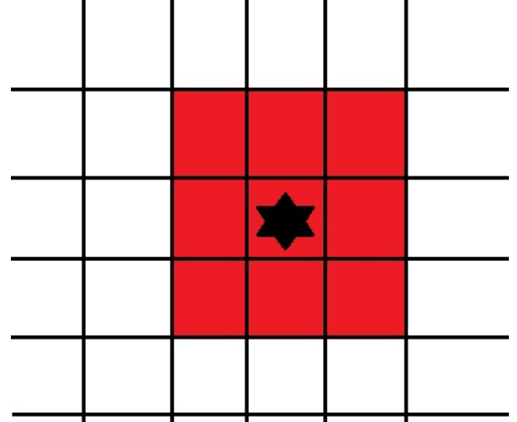
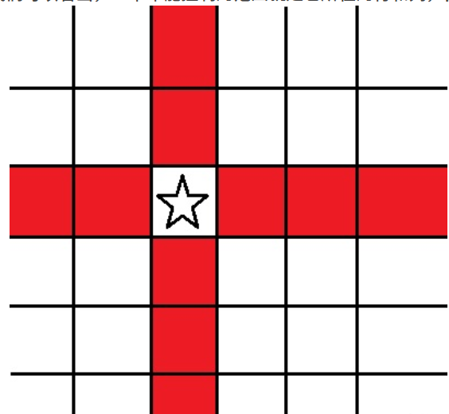
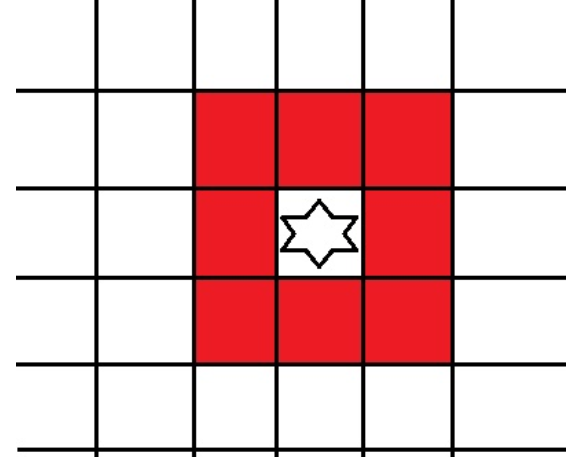
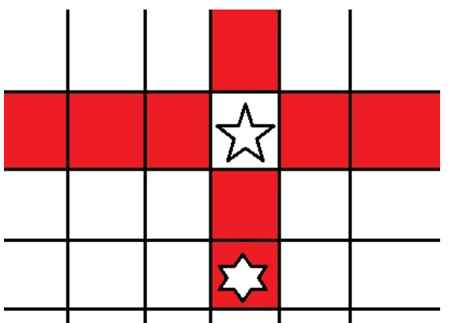

原题：CF42B

难度：1700

算法：模拟

## 思路

### 题意：
给出两个白车和白王、黑王的位置，判断黑王是否会被吃掉。

我们使用红色代表白方能够控制的格子，显然，要满足黑王被吃掉，就要使它所在的格子和能走到的格子都被控制，如下图所示：


 所以，我们只需要判断黑王自己及其周围一圈的格子是否都被染成红色就可以了。

根据题目，我们可以看出，一个车能控制的范围就是它所在的行和列，但是不包括本身所在的格子。

如下图所示：


这样，我们就能写出车控制格子的代码：
```cpp
cin>>s;
for(int i=1;i<=8;i++){
	if(i==s[1]-'0')continue;//不包含自己
	mp[s[0]-'a'+1][i]++;
}
for(int i=1;i<=8;i++){
	if(i==s[0]-'a'+1)continue;//不包含自己
	mp[i][s[1]-'0']++;
}
```
接下来，我们来看国王，国王控制的是周围的 8 个格子，如下图所示：


这样，我们就能写出相应程序了。

```cpp
cin>>s;
int sx=s[0]-'a'+1,sy=s[1]-'0';
for(int i=1;i<=8;i++){
	if(sx+dx[i]<1||sx+dx[i]>8||sy+dy[i]<1||sy+dy[i]>8)continue;//考虑越界
	mp[sx+dx[i]][sy+dy[i]]++;
}
```
但是，我们考虑下面的情况：



如图所示，国王挡住了车的攻击使得车无法攻击到国王另一侧的格子，这时，我们考虑开一个数组记录车的坐标，我们把国王摆好后，看是否有车与国王同行/同列。如果有，那么另一侧的格子就不能被染色。（但是如果另一个车能攻击到，还是会被染色。）

```cpp
for(int j=1;j<=2;j++){
	if(roots[j][0]==sx){//行相同
		if(roots[j][1]>sy)for(int i=1;i<=sy-1;i++)mp[sx][i]--;//在左侧
		else for(int i=sy+1;i<=8;i++)mp[sx][i]--;//在右侧
	}
	if(roots[j][1]==sy){//列相同
		if(roots[j][0]>sx)for(int i=1;i<=sx-1;i++)mp[i][sy]--;//在上侧
		else for(int i=sx+1;i<=8;i++)mp[i][sy]--;//在下侧
	}
}
```
这样，将所有格子染完色以后，只要判断黑王的 9 个格子是否都被染色就可以了。
```cpp
cin>>s;
sx=s[0]-'a'+1,sy=s[1]-'0';
for(int i=0;i<=8;i++){
	if(sx+dx[i]<1||sx+dx[i]>8||sy+dy[i]<1||sy+dy[i]>8)continue;//越界
	if(!mp[sx+dx[i]][sy+dy[i]]){
		cout<<"OTHER";//如果有一个没被染色，那么就不会被吃
		return 0;
	}
}
cout<<"CHECKMATE";
```
## 实现

```cpp
#include <bits/stdc++.h>
#define f(i,a,b) for(int i=a;i<=b;i++)
using namespace std;
int mp[9][9];
char s[2];
int dx[9]={0,0,0,1,-1,1,1,-1,-1};
int dy[9]={0,1,-1,0,0,1,-1,1,-1};
int roots[3][2];
int main(){
	f(i,1,2){//两个车
		cin>>s;
		roots[i][0]=s[0]-'a'+1;//坐标转换，下面同理
		roots[i][1]=s[1]-'0';
		f(i,1,8){//将这行染色
			if(i==s[1]-'0')continue;
			mp[s[0]-'a'+1][i]++;
		}
		f(i,1,8){//这列也染色
			if(i==s[0]-'a'+1)continue;
			mp[i][s[1]-'0']++;
		}
	}
	cin>>s;//处理白王
	int sx=s[0]-'a'+1,sy=s[1]-'0';
	f(i,1,8){
		if(sx+dx[i]<1||sx+dx[i]>8||sy+dy[i]<1||sy+dy[i]>8)continue;
		mp[sx+dx[i]][sy+dy[i]]++;
	}
	f(j,1,2){//检测是否挡住车
		if(roots[j][0]==sx){
			if(roots[j][1]>sy)f(i,1,sy-1)mp[sx][i]--;
			else f(i,sy+1,8)mp[sx][i]--;
		}
		if(roots[j][1]==sy){
			if(roots[j][0]>sx)f(i,1,sx-1)mp[i][sy]--;
			else f(i,sx+1,8)mp[i][sy]--;
		}
	}
	cin>>s;
	sx=s[0]-'a'+1,sy=s[1]-'0';
	f(i,0,8){//检测黑王周围格子
		if(sx+dx[i]<1||sx+dx[i]>8||sy+dy[i]<1||sy+dy[i]>8)continue;
		if(!mp[sx+dx[i]][sy+dy[i]]){
			cout<<"OTHER";//能走掉
			return 0;
		}
	}
	cout<<"CHECKMATE";
	return 0;
}
```